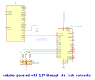

# RGB LED DEMO - DOCUMENTATION

## 1. What the Demo Does

The RGB LED demo illustrates how to control an RGB LED's colors using an external display with sliders for red, green, and blue channels. It uses the Lumen Protocol to handle serial communication, updating the LED's color in real-time based on user input. Additionally, it displays the current color as an RGB-565 value and its hexadecimal representation on the display.

This project demonstrates interactive control of hardware components (LED) using live data sent via serial communication.

## 2. Purpose

The primary purpose of this project is to demonstrate how to receive serial packets to control hardware components and visually represent those changes on an external display. It's useful for learning real-time data-driven hardware control and integrating displays for enhanced interactivity.

## 3. How to Use

### 3.1 Setting Up the Hardware

To set up the RGB LED system:

1. Connect an RGB LED's pins to the following Arduino pins:
   - **Red**: Pin 9 (via a 220Ω resistor)
   - **Green**: Pin 10 (via a 220Ω resistor)
   - **Blue**: Pin 11 (via a 220Ω resistor)
2. Connect the cathode (common ground) of the RGB LED to the Arduino's GND pin.
3. Connect the display to the Arduino via a serial connection and ensure proper power supply (5V or 12V).

### 3.2 Sending Commands from the Display

The display provides sliders for red, green, and blue channels. Adjusting these sliders sends serial packets with intensity values (0-255) for each channel:

### 3.3 Power Supply

- The Arduino can be powered via USB (5V) or an external 5V power source.
- The display requires a compatible power source (5V) connected to its +Vin and GND pins.

## 4. Schematic Circuit

Below is the schematic for the RGB LED setup:




## 5. Code Overview

The following C++ code is used for the RGB LED demo. It initializes communication via the Lumen Protocol, updates LED colors based on slider inputs, and sends the current color back to the display in HEX format.

### Key Features:
- **Serial Communication**: Handled by `lumen_available()` and `lumen_get_first_packet()`.
- **RGB LED Control**: Adjusts PWM values on pins 9, 10, and 11 based on slider inputs.
- **Color Representation**:
  - **RGB-565**: A 16-bit compact format sent to the display.
  - **HEX**: A standard color code for visualization.

```cpp
#include "LumenProtocol.h"

extern "C" void lumen_write_bytes(uint8_t* data, uint32_t length) {
  Serial.write(data, length);
}

extern "C" uint16_t lumen_get_byte() {
  if (Serial.available()) {
    return Serial.read();
  }
  return DATA_NULL;
}

#define LCM_BAUD_RATE 115200
const uint8_t RED_PIN = 9, GREEN_PIN = 10, BLUE_PIN = 11;
const uint8_t RED_SLIDER_ADDRESS = 30, GREEN_SLIDER_ADDRESS = 50, BLUE_SLIDER_ADDRESS = 40;
const uint8_t PALETTE_COLORS_ADDRESS = 206, HEX_COLOR_DISPLAY_ADDRESS = 200;

char hexColorString[10];
uint8_t colorLedRed = 0, colorLedGreen = 0, colorLedBlue = 0;
uint16_t color565Palette = 0;
lumen_packet_t paletteColors = { PALETTE_COLORS_ADDRESS, kS16 };
lumen_packet_t hexColorDisplay = { HEX_COLOR_DISPLAY_ADDRESS, kString };

void updatePaletteColor() {
  color565Palette = ((colorLedRed >> 3) << 11) | ((colorLedGreen >> 2) << 5) | (colorLedBlue >> 3);
  paletteColors.data._s16 = color565Palette;
  lumen_write_packet(&paletteColors);
}

void updateHexColor() {
  snprintf(hexColorString, sizeof(hexColorString), "#%02X%02X%02X", colorLedRed, colorLedGreen, colorLedBlue);
  strncpy(hexColorDisplay.data._string, hexColorString, sizeof(hexColorDisplay.data._string));
  lumen_write_packet(&hexColorDisplay);
}

void processPacket(lumen_packet_t* packet) {
  if (packet->address == RED_SLIDER_ADDRESS) {
    colorLedRed = packet->data._s32;
    analogWrite(RED_PIN, colorLedRed);
  } else if (packet->address == GREEN_SLIDER_ADDRESS) {
    colorLedGreen = packet->data._s32;
    analogWrite(GREEN_PIN, colorLedGreen);
  } else if (packet->address == BLUE_SLIDER_ADDRESS) {
    colorLedBlue = packet->data._s32;
    analogWrite(BLUE_PIN, colorLedBlue);
  }
  updatePaletteColor();
  updateHexColor();
}

void setup() {
  delay(1000);
  Serial.begin(LCM_BAUD_RATE);
  pinMode(RED_PIN, OUTPUT);
  pinMode(GREEN_PIN, OUTPUT);
  pinMode(BLUE_PIN, OUTPUT);
}

void loop() {
  while (lumen_available() > 0) {
    lumen_packet_t* currentPacket = lumen_get_first_packet();
    processPacket(currentPacket);
  }
}

